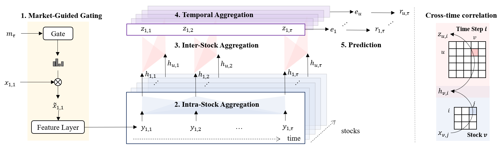

# Readme 
This is the official code and supplementary materials for our AAAI-2024 paper: **MASTER: Market-Guided Stock Transformer for Stock Price Forecasting**. [[Paper]](https://ojs.aaai.org/index.php/AAAI/article/view/27767)  [[ArXiv preprint]](https://arxiv.org/abs/2312.15235) 

MASTER is a stock transformer for stock price forecasting, which models the momentary and cross-time stock correlation and guides feature selection with market information.



Our original experiments were conducted in a complex business codebase developed based on Qlib. The original code is confidential and exhaustive. In order to enable anyone to quickly use MASTER, here we publish our well-processed data and core code. 

## :fire: Important Notice on 2024-12-07
Our previous published valid & test data are problematic as we mistakenly used the training processors when dumping them out from our codebase. We recently found out this issue that previously published valid & test data per day contains 95% of all stocks, but in our original experiment, we used all stocks. The original datasource and codebase are the company's properties. It is sad that although we tried a lot to publish the dumped data for everyone, we ended up with mistake operations. Now our access has expired and we cannot dump the original correct valid & test data again. 

We try to remedy it with this [opensource data](https://github.com/chenditc/investment_data/releases), and process it again with the Qlib framework. You can now download them from one of the following links (the data files are the same) and seamlessly use them in this lightweight repo. 

- :fire:[Update opensource data][OneDrive link](https://1drv.ms/f/c/652674690cc447e6/Eu8Kxv4xxTFMtDQqTW0IU0UB8rnpjACA5twMi8BA_PfbSA)
- :fire:[Update opensource data][MEGA link](https://mega.nz/folder/MS8mUTbL#qeVz3KR1-MyXc_uLPtkvTg)
- :fire:[Update opensource data][Baidu link](https://pan.baidu.com/s/1qmDIepmGY1DVBTGGiipxfA?pwd=pm49). 

Our original codebase implemented a DropExtremeLabel processor that 1) drop 5% extreme labels during training and 2) predict for all stocks on inference. Since the Qlib framework does not own such a processor, we add a few lines in <code>base_model.py/SequenceModel/train_epoch </code> to clumsily perform DropExtremeLabel and CSZcoreNorm during training. You can find comments in the code and read more in the <code> Readme:Preprocessing </code>.

Luckily, for training, you can still choose from the original data or opensource data. The original training data including market information are correctly dumped.Here we attach results with the renewed data and seed 0-4 in <code>model/performance.xlsx</code>. We did not tune on hyperparameters. Since the data source is changed, you may want to tune on beta and the stopping epoch. 

For any questions, please first check on the closed issues, and then open a new one if necessary. We made a lot of efforts to share the outcomings of this research during the years after publication, although most of the the authors had moved on to other researches. Thank you very much for the attention and understanding :smile:

## Usage
1. Install dependencies.
- pandas == 1.5.3
- torch == 1.11.0

2. Install [Qlib](https://github.com/microsoft/qlib). We have minimized the reliance on Qlib, and you can simply install it by
- <code>pip install pyqlib </code>

3. Download data and unpack it into <code> data/ </code>

4. Run main.py. Depending on which data you want to train on, remember to change the lines in <code> base_model.py/SequenceModel/train_epoch </code>.

5. We provide models trained on the original data or opensource data: <code> model/csi300_original_0.pkl, model/csi800_original_0.pkl, model/csi300_opensource_0.pkl, model/csi800_opensource_0.pkl</code>


## Dataset
### Form
The downloaded data is split into training, validation, and test sets, with two stock universes. Note the csi300 data is a subset of the csi800 data. You can use the following code to investigate the **datetime, instrument, and feature formulation**.
```python
with (f'data/original/csi300_dl_train.pkl', 'rb') as f:
    dl_train = pickle.load(f)
    dl_train.data # a Pandas dataframe
```
In our codebase, the data are gathered chronically and then grouped by prediction dates. the <code> data </code> iterated by the data loader is of shape (N, T, F), where:
- N - number of stocks. For CSI300, N is around 300 on each prediction date; For CSI800, N is around 800 on each prediction date.
- T - length of lookback_window, T=8.
- F - 222 in total, including 158 factors, 63 market information, and 1 label.        

### Market information
For convenient reference, we extract and organize market information from the published data into <code>data/csi_market_information.csv</code>. You can check the **datetime and feature formulation** in the file. Note that m is shared by all stocks. The market data is generated by the following pseudo-code. 

```python
m = []
for S in csi300, csi500, csi800:
  m += [market_index(S,-1)]
  for d in [5, 10, 20, 30, 60]:
    m += [historical_market_index_mean(S, d), historical_market_index_std(S, d)]
    m += [historical_amount_mean(S, d), historical_amount_std(S, d)]
```

### Preprocessing
The published data went through the following necessary preprocessing. 

1. For features, we first perform [**RobustZScoreNorm**](https://github.com/microsoft/qlib/blob/main/qlib/data/dataset/processor.py), which computes median and MAD for each feature of all stocks in the training timespan for normalization. It then clips outliers as -3 and 3. When processing the test data, the median and MAD for each feature are **estimated by** (or borrowed from) the training data, so that we have no data leakage. We then use [**Fillna**](https://github.com/microsoft/qlib/blob/main/qlib/data/dataset/processor.py) to fill the NA features as default value 0. The processing on features are the same for the original data and the opensource data.
   
2. For labels, **during training**, we first DropNA labels and 5% of the most extreme labels, then we perform [**CSZscoreNorm**](https://github.com/microsoft/qlib/blob/main/qlib/data/dataset/processor.py). The downloaded **original training data** already performed  DropNA DropExtreme, and CSZscoreNorm on labels. The downloaded opensource training, validation, and test data, only performed DropNA labels. We clumsily perform DropExtreme and CSZscoreNorm for training. Please refer to the comments in <code>base_model.py/SequenceModel/train_epoch </code>.

**CSZcoreNorm** is a common practice in Qlib to standardize the labels for stock price forecasting. Here 'CS' stands for Cross-Sectional, which means we group the labels on each date and compute mean/std across stocks for normalization. To mitigate the difference between a normal distribution and groundtruth distribution, we use **DropExtremeLabel** to filter out 5\% of most extreme labels in training. 

Note that for the reported metrics (IC, RankIC, etc.), **whether to normalize the groundtruth label won't change the value**, and nan in the groundtruth will be ignored.


## A Qlib implementation
We are happy to hear that there is a Qlib-implementation of MASTER at this [repo](https://github.com/SJTU-Quant/qlib/tree/main/examples/benchmarks/MASTER). We thank [LIU, Qiaoan](https://github.com/zhiyuan5986) and [ZHAO, Lifan](https://github.com/MogicianXD) for their contributions and please also give credits to the new repo if you use it. With the Qlib framework, you can **report AR, IR**, and more portfolio-based metrics. We intend not to rebuild the entire backtest framework again in this repo.

In the meantime, please note that
- **Default Datasource**: The new version utilizes a default data source published by Qlib, which covers a different timespan. It also uses **stock universe CSI300 & CSI500**, because qlib does **not** include a CSI800 dataset. Correspondingly, **the representative indices to construct market information are different**, it uses CSI100, CSI300, and CSI500, which is different from CSI300, CSI500, and CSI800 as in this repo. 

- **More Complete Datasource**: You can substitute the Qlib data with this [opensource data](https://github.com/chenditc/investment_data/releases) to align with our experimented timespan and experiment on CSI800. All other data sources are considered **logically equal** to our published data but may differ in values (usually one is imcomplete) because we use different automatic tools (such as crawler) to collect these data. Correpondingly, you may want to instantiate market information the same as in the original paper. You can modify the return value of <code>qlib/contrib/data/dataset.py</code>, <code> marketDataHandler:get_feature_config</code> with 
```python
['Mask($close/Ref($close,1)-1, "sh000300")', 'Mask(Mean($close/Ref($close,1)-1,5), "sh000300")', 'Mask(Std($close/Ref($close,1)-1,5), "sh000300")', 'Mask(Mean($amount,5)/$amount, "sh000300")', 'Mask(Std($amount,5)/$amount, "sh000300")', 'Mask(Mean($close/Ref($close,1)-1,10), "sh000300")', 'Mask(Std($close/Ref($close,1)-1,10), "sh000300")', 'Mask(Mean($amount,10)/$amount, "sh000300")', 'Mask(Std($amount,10)/$amount, "sh000300")', 'Mask(Mean($close/Ref($close,1)-1,20), "sh000300")', 'Mask(Std($close/Ref($close,1)-1,20), "sh000300")', 'Mask(Mean($amount,20)/$amount, "sh000300")', 'Mask(Std($amount,20)/$amount, "sh000300")', 'Mask(Mean($close/Ref($close,1)-1,30), "sh000300")', 'Mask(Std($close/Ref($close,1)-1,30), "sh000300")', 'Mask(Mean($amount,30)/$amount, "sh000300")', 'Mask(Std($amount,30)/$amount, "sh000300")', 'Mask(Mean($close/Ref($close,1)-1,60), "sh000300")', 'Mask(Std($close/Ref($close,1)-1,60), "sh000300")', 'Mask(Mean($amount,60)/$amount, "sh000300")', 'Mask(Std($amount,60)/$amount, "sh000300")',
'Mask($close/Ref($close,1)-1, "sh000905")', 'Mask(Mean($close/Ref($close,1)-1,5), "sh000905")', 'Mask(Std($close/Ref($close,1)-1,5), "sh000905")', 'Mask(Mean($amount,5)/$amount, "sh000905")', 'Mask(Std($amount,5)/$amount, "sh000905")', 'Mask(Mean($close/Ref($close,1)-1,10), "sh000905")', 'Mask(Std($close/Ref($close,1)-1,10), "sh000905")', 'Mask(Mean($amount,10)/$amount, "sh000905")', 'Mask(Std($amount,10)/$amount, "sh000905")', 'Mask(Mean($close/Ref($close,1)-1,20), "sh000905")', 'Mask(Std($close/Ref($close,1)-1,20), "sh000905")', 'Mask(Mean($amount,20)/$amount, "sh000905")', 'Mask(Std($amount,20)/$amount, "sh000905")', 'Mask(Mean($close/Ref($close,1)-1,30), "sh000905")', 'Mask(Std($close/Ref($close,1)-1,30), "sh000905")', 'Mask(Mean($amount,30)/$amount, "sh000905")', 'Mask(Std($amount,30)/$amount, "sh000905")', 'Mask(Mean($close/Ref($close,1)-1,60), "sh000905")', 'Mask(Std($close/Ref($close,1)-1,60), "sh000905")', 'Mask(Mean($amount,60)/$amount, "sh000905")', 'Mask(Std($amount,60)/$amount, "sh000905")',
'Mask($close/Ref($close,1)-1, "sh000906")', 'Mask(Mean($close/Ref($close,1)-1,5), "sh000906")', 'Mask(Std($close/Ref($close,1)-1,5), "sh000906")', 'Mask(Mean($amount,5)/$amount, "sh000906")', 'Mask(Std($amount,5)/$amount, "sh000906")', 'Mask(Mean($close/Ref($close,1)-1,10), "sh000906")', 'Mask(Std($close/Ref($close,1)-1,10), "sh000906")', 'Mask(Mean($amount,10)/$amount, "sh000906")', 'Mask(Std($amount,10)/$amount, "sh000906")', 'Mask(Mean($close/Ref($close,1)-1,20), "sh000906")', 'Mask(Std($close/Ref($close,1)-1,20), "sh000906")', 'Mask(Mean($amount,20)/$amount, "sh000906")', 'Mask(Std($amount,20)/$amount, "sh000906")', 'Mask(Mean($close/Ref($close,1)-1,30), "sh000906")', 'Mask(Std($close/Ref($close,1)-1,30), "sh000906")', 'Mask(Mean($amount,30)/$amount, "sh000906")', 'Mask(Std($amount,30)/$amount, "sh000906")', 'Mask(Mean($close/Ref($close,1)-1,60), "sh000906")', 'Mask(Std($close/Ref($close,1)-1,60), "sh000906")', 'Mask(Mean($amount,60)/$amount, "sh000906")', 'Mask(Std($amount,60)/$amount, "sh000906")'],
['Mask($close/Ref($close,1)-1, "sh000300")', 'Mask(Mean($close/Ref($close,1)-1,5), "sh000300")', 'Mask(Std($close/Ref($close,1)-1,5), "sh000300")', 'Mask(Mean($amount,5)/$amount, "sh000300")', 'Mask(Std($amount,5)/$amount, "sh000300")', 'Mask(Mean($close/Ref($close,1)-1,10), "sh000300")', 'Mask(Std($close/Ref($close,1)-1,10), "sh000300")', 'Mask(Mean($amount,10)/$amount, "sh000300")', 'Mask(Std($amount,10)/$amount, "sh000300")', 'Mask(Mean($close/Ref($close,1)-1,20), "sh000300")', 'Mask(Std($close/Ref($close,1)-1,20), "sh000300")', 'Mask(Mean($amount,20)/$amount, "sh000300")', 'Mask(Std($amount,20)/$amount, "sh000300")', 'Mask(Mean($close/Ref($close,1)-1,30), "sh000300")', 'Mask(Std($close/Ref($close,1)-1,30), "sh000300")', 'Mask(Mean$($amount,30)/$amount, "sh000300")', 'Mask(Std($amount,30)/$amount, "sh000300")', 'Mask(Mean($close/Ref($close,1)-1,60), "sh000300")', 'Mask(Std($close/Ref($close,1)-1,60), "sh000300")', 'Mask(Mean($amount,60)/$amount, "sh000300")', 'Mask(Std($amount,60)/$amount, "sh000300")',
'Mask($close/Ref($close,1)-1, "sh000905")', 'Mask(Mean($close/Ref($close,1)-1,5), "sh000905")', 'Mask(Std($close/Ref($close,1)-1,5), "sh000905")', 'Mask(Mean($amount,5)/$amount, "sh000905")', 'Mask(Std($amount,5)/$amount, "sh000905")', 'Mask(Mean($close/Ref($close,1)-1,10), "sh000905")', 'Mask(Std($close/Ref($close,1)-1,10), "sh000905")', 'Mask(Mean($amount,10)/$amount, "sh000905")', 'Mask(Std($amount,10)/$amount, "sh000905")', 'Mask(Mean($close/Ref($close,1)-1,20), "sh000905")', 'Mask(Std($close/Ref($close,1)-1,20), "sh000905")', 'Mask(Mean($amount,20)/$amount, "sh000905")', 'Mask(Std($amount,20)/$amount, "sh000905")', 'Mask(Mean($close/Ref($close,1)-1,30), "sh000905")', 'Mask(Std($close/Ref($close,1)-1,30), "sh000905")', 'Mask(Mean($amount,30)/$amount, "sh000905")', 'Mask(Std($amount,30)/$amount, "sh000905")', 'Mask(Mean($close/Ref($close,1)-1,60), "sh000905")', 'Mask(Std($close/Ref($close,1)-1,60), "sh000905")', 'Mask(Mean($amount,60)/$amount, "sh000905")', 'Mask(Std($amount,60)/$amount, "sh000905")',
'Mask($close/Ref($close,1)-1, "sh000906")', 'Mask(Mean($close/Ref($close,1)-1,5), "sh000906")', 'Mask(Std($close/Ref($close,1)-1,5), "sh000906")', 'Mask(Mean($amount,5)/$amount, "sh000906")', 'Mask(Std($amount,5)/$amount, "sh000906")', 'Mask(Mean($close/Ref($close,1)-1,10), "sh000906")', 'Mask(Std($close/Ref($close,1)-1,10), "sh000906")', 'Mask(Mean($amount,10)/$amount, "sh000906")', 'Mask(Std($amount,10)/$amount, "sh000906")', 'Mask(Mean($close/Ref($close,1)-1,20), "sh000906")', 'Mask(Std($close/Ref($close,1)-1,20), "sh000906")', 'Mask(Mean($amount,20)/$amount, "sh000906")', 'Mask(Std($amount,20)/$amount, "sh000906")', 'Mask(Mean($close/Ref($close,1)-1,30), "sh000906")', 'Mask(Std($close/Ref($close,1)-1,30), "sh000906")', 'Mask(Mean($amount,30)/$amount, "sh000906")', 'Mask(Std($amount,30)/$amount, "sh000906")', 'Mask(Mean($close/Ref($close,1)-1,60), "sh000906")', 'Mask(Std($close/Ref($close,1)-1,60), "sh000906")', 'Mask(Mean($amount,60)/$amount, "sh000906")', 'Mask(Std($amount,60)/$amount, "sh000906")']
```


- **DropExtremeLabel**: The new version does **not** include the 'DropExtremeLabel' operation in data preprocessing. You may want to implement them in code because it will improve performance, as we clumsily did in <code>MASTER:base_model.py/SequenceModel/train_epoch</code>. 

- **"Qlib is soooo complicated!"**: The usage of Qlib can be daunting if you are completely new to it. That is why we open this repo to eliminate the reliance on Qlib. The contributors to MASTER-Qlib implementation are volunteers that did not participate in the original research of MASTER, please stick to this repo if there are inconsistency. Moreover, please refrain us from answering questions on how to use Qlib. 


## Cite
If you use the data or the code, please cite our work! :smile:
```latex
@inproceedings{li2024master,
  title={Master: Market-guided stock transformer for stock price forecasting},
  author={Li, Tong and Liu, Zhaoyang and Shen, Yanyan and Wang, Xue and Chen, Haokun and Huang, Sen},
  booktitle={Proceedings of the AAAI Conference on Artificial Intelligence},
  volume={38},
  number={1},
  pages={162--170},
  year={2024}
}
```


